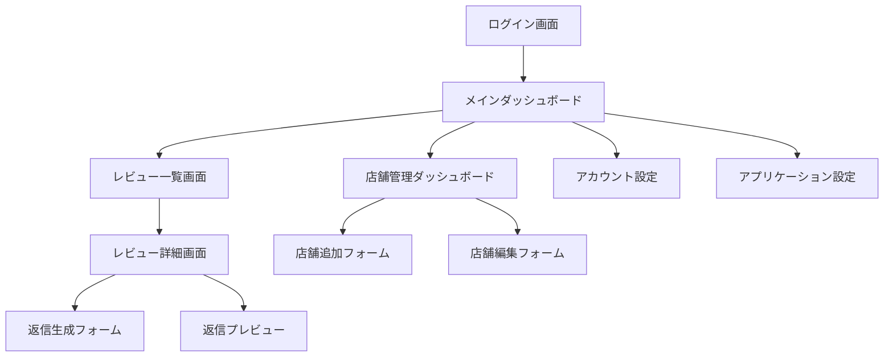

# 画面設計書

## 画面一覧

### 認証関連

1. **ログイン画面**
   - メール/パスワードログイン
   - Googleログイン
   - LINEログイン
   - パスワードリセット

2. **サインアップ画面**
   - メール/パスワード登録
   - Googleアカウント登録
   - LINEアカウント登録
   - 利用規約同意

### ダッシュボード

1. **メインダッシュボード**
   - レビュー統計
   - 最近のレビュー
   - 返信率グラフ
   - アクティビティログ

2. **店舗管理ダッシュボード**
   - 店舗一覧
   - 店舗追加フォーム
   - 店舗編集フォーム
   - Google連携設定

### レビュー管理

1. **レビュー一覧画面**
   - フィルタリング
   - ソート機能
   - ページネーション
   - 一括操作

2. **レビュー詳細画面**
   - レビュー内容
   - 返信履歴
   - 返信生成フォーム
   - 返信プレビュー

### 設定

1. **アカウント設定**
   - プロフィール編集
   - パスワード変更
   - 2段階認証設定
   - 通知設定

2. **アプリケーション設定**
   - 言語設定
   - テーマ設定
   - 表示設定
   - データエクスポート

## 画面遷移図



## 画面レイアウト

### 共通レイアウト

1. **ヘッダー**
   - ロゴ
   - ナビゲーションメニュー
   - ユーザーメニュー
   - 通知アイコン

2. **サイドバー**
   - メインメニュー
   - サブメニュー
   - 折りたたみ機能

3. **フッター**
   - コピーライト
   - リンク集
   - バージョン情報

### レスポンシブ対応

1. **デスクトップ（1024px以上）**
   - サイドバー表示
   - グリッドレイアウト
   - 詳細情報表示

2. **タブレット（768px-1023px）**
   - サイドバー折りたたみ
   - 2カラムレイアウト
   - 簡易情報表示

3. **モバイル（767px以下）**
   - ハンバーガーメニュー
   - 1カラムレイアウト
   - 最小限の情報表示

## 画面詳細

### メインダッシュボード

1. **レイアウト**
   ```
   +------------------+------------------+
   |    ヘッダー     |    ヘッダー     |
   +------------------+------------------+
   |                  |                  |
   |    サイドバー    |    メイン       |
   |                  |    コンテンツ   |
   |                  |                  |
   +------------------+------------------+
   |                  |                  |
   |    フッター     |    フッター     |
   +------------------+------------------+
   ```

2. **コンポーネント**
   - 統計カード
   - グラフ
   - アクティビティリスト
   - クイックアクションボタン

### レビュー一覧画面

1. **レイアウト**
   ```
   +------------------+------------------+
   |    ヘッダー     |    ヘッダー     |
   +------------------+------------------+
   |                  |    検索        |
   |    サイドバー    |    フィルター  |
   |                  |    レビュー    |
   |                  |    リスト      |
   +------------------+------------------+
   |                  |                  |
   |    フッター     |    フッター     |
   +------------------+------------------+
   ```

2. **コンポーネント**
   - 検索バー
   - フィルター
   - レビューカード
   - ページネーション

## 画面仕様

### 共通仕様

1. **ヘッダー**
   - 高さ: 64px
   - 背景色: 白
   - 影: 1px
   - 固定表示

2. **サイドバー**
   - 幅: 240px
   - 背景色: グレー50
   - 折りたたみ時: 64px
   - 固定表示

3. **フッター**
   - 高さ: 48px
   - 背景色: グレー50
   - テキスト: グレー500
   - 固定表示

### 画面固有仕様

1. **ダッシュボード**
   - グリッド: 12カラム
   - カード間隔: 24px
   - パディング: 24px
   - スクロール可能

2. **レビュー一覧**
   - カード幅: 100%
   - カード間隔: 16px
   - パディング: 16px
   - スクロール可能

## 画面遷移条件

### 認証関連

1. **ログイン**
   - 未認証時: ログイン画面へ
   - 認証済み: ダッシュボードへ
   - エラー時: エラーメッセージ表示

2. **サインアップ**
   - 新規登録: サインアップ画面へ
   - 登録完了: ダッシュボードへ
   - エラー時: エラーメッセージ表示

### レビュー関連

1. **レビュー一覧**
   - 店舗選択時: フィルタリング
   - ステータス変更時: リスト更新
   - ページ変更時: データ再取得

2. **レビュー詳細**
   - レビュー選択時: 詳細表示
   - 返信生成時: プレビュー表示
   - 返信投稿時: ステータス更新

## 画面状態管理

### グローバル状態

1. **認証状態**
   - ログイン状態
   - ユーザー情報
   - 権限情報

2. **UI状態**
   - テーマ設定
   - 言語設定
   - 通知設定

### ローカル状態

1. **フォーム状態**
   - 入力値
   - バリデーション
   - 送信状態

2. **リスト状態**
   - フィルター条件
   - ソート条件
   - ページネーション 