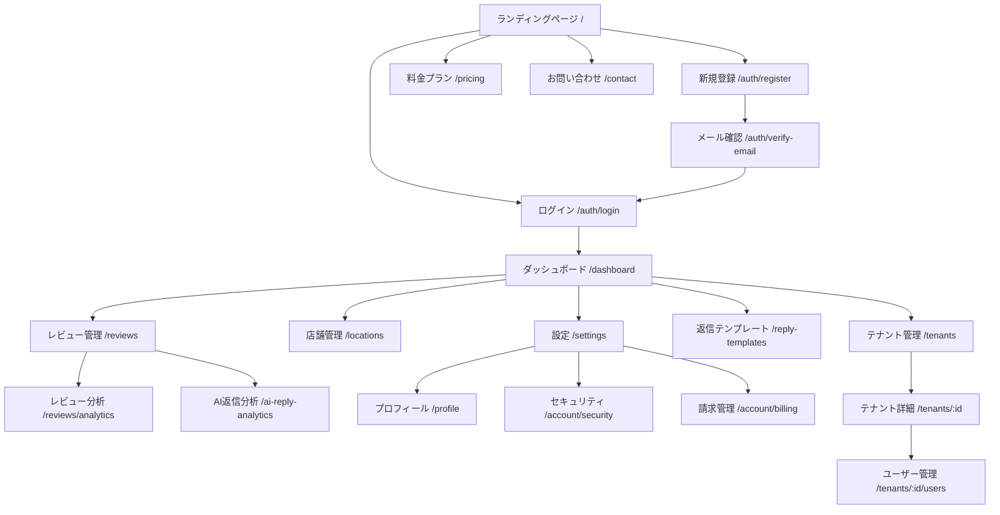

# 画面設計書

## 画面一覧

### 認証関連

| パス | 画面名 | 状態 |
|------|--------|------|
| `/auth/login` | ログイン | 実装済み |
| `/auth/register` | 新規登録 | 実装済み |
| `/auth/signup` | サインアップ（リダイレクト） | 実装済み |
| `/auth/verify-email` | メール確認 | 実装済み |

**ログイン画面**
- メール/パスワードログイン
- パスワードリセットリンク
- 新規登録リンク

**新規登録画面**
- メール/パスワード登録
- 確認メール送信
- 利用規約同意

> **注**: Google/LINEログインは未実装（計画中）

---

### ダッシュボード

| パス | 画面名 | 状態 |
|------|--------|------|
| `/dashboard` | メインダッシュボード | 実装済み |

**メインダッシュボード**
- レビュー統計カード（総数、平均評価、返信率）
- 最近のレビュー一覧
- 店舗別パフォーマンス
- クイックアクション

---

### レビュー管理

| パス | 画面名 | 状態 |
|------|--------|------|
| `/reviews` | レビュー一覧 | 実装済み |
| `/reviews/analytics` | レビュー分析 | 実装済み |

**レビュー一覧画面**
- 店舗フィルター
- ステータスフィルター（未対応/対応済み/無視）
- 評価フィルター
- ページネーション
- AI返信生成ボタン
- バルク返信生成
- トーンセレクター

**レビュー分析画面**
- 評価分布グラフ
- トレンド分析
- 期間別統計

---

### AI返信

| パス | 画面名 | 状態 |
|------|--------|------|
| `/ai-reply-analytics` | AI返信分析 | 実装済み |

**AI返信分析画面**
- 生成数統計
- トーン別使用状況
- 返信品質メトリクス

---

### 店舗管理

| パス | 画面名 | 状態 |
|------|--------|------|
| `/locations` | 店舗一覧 | 実装済み |

**店舗一覧画面**
- Google Business連携店舗一覧
- 店舗追加/編集
- 同期状態表示

---

### 返信テンプレート

| パス | 画面名 | 状態 |
|------|--------|------|
| `/reply-templates` | 返信テンプレート管理 | 実装済み |

**返信テンプレート管理画面**
- テンプレート一覧
- カテゴリ別表示
- テンプレート作成/編集/削除
- プレビュー機能

---

### 設定

| パス | 画面名 | 状態 |
|------|--------|------|
| `/settings` | 設定 | 実装済み |
| `/profile` | プロフィール | 実装済み |
| `/account/security` | セキュリティ設定 | 実装済み |
| `/account/billing` | 請求管理 | 実装済み |

**設定画面**
- Google Business Profile連携
- 通知設定

**プロフィール画面**
- 基本情報編集
- アバター設定

**セキュリティ設定画面**
- パスワード変更
- 2段階認証（MFA）設定
- ログイン履歴

**請求管理画面**
- 現在のプラン表示
- プラン変更
- 請求履歴

---

### テナント管理

| パス | 画面名 | 状態 |
|------|--------|------|
| `/tenants` | テナント一覧 | 実装済み |
| `/tenants/[id]` | テナント詳細 | 実装済み |
| `/tenants/[id]/users` | テナントユーザー管理 | 実装済み |

**テナント一覧画面**
- 所属テナント一覧
- テナント作成

**テナント詳細画面**
- テナント情報
- 設定編集

**テナントユーザー管理画面**
- メンバー一覧
- ユーザー招待
- ロール管理

---

### サブスクリプション

| パス | 画面名 | 状態 |
|------|--------|------|
| `/pricing` | 料金プラン | 実装済み |
| `/subscription-history` | サブスクリプション履歴 | 実装済み |

**料金プラン画面**
- プラン比較表
- 機能一覧
- 申込みボタン

**サブスクリプション履歴画面**
- 支払い履歴
- 請求書一覧

---

### 管理者

| パス | 画面名 | 状態 |
|------|--------|------|
| `/admin/users` | ユーザー管理 | 実装済み |
| `/admin/billing/invoices` | 請求書管理 | 実装済み |
| `/admin/stripe-test` | Stripeテスト | 実装済み |

---

### 法的ページ

| パス | 画面名 | 状態 |
|------|--------|------|
| `/legal/privacy` | プライバシーポリシー | 実装済み |
| `/legal/terms` | 利用規約 | 実装済み |
| `/legal/google-api-disclosure` | Google API開示 | 実装済み |

---

### その他

| パス | 画面名 | 状態 |
|------|--------|------|
| `/` | ランディングページ | 実装済み |
| `/contact` | お問い合わせ | 実装済み |

---

## 画面遷移図

---

## 共通レイアウト

### ヘッダー（認証後）
- ロゴ（ホームへリンク）
- ナビゲーションメニュー
- ユーザーメニュー（アバター、ログアウト）

### サイドバー
- ダッシュボード
- レビュー管理
- 店舗管理
- 返信テンプレート
- 分析
- 設定

### フッター
- コピーライト
- プライバシーポリシー
- 利用規約

---

## レスポンシブ対応

| ブレイクポイント | レイアウト |
|------------------|------------|
| デスクトップ（1024px以上） | サイドバー表示、グリッドレイアウト |
| タブレット（768px-1023px） | サイドバー折りたたみ、2カラム |
| モバイル（767px以下） | ハンバーガーメニュー、1カラム |

---

## デザインシステム

「Quiet Confidence」デザインシステムを採用。

### カラー
- キャンバス: `#FFFFFF`
- インク: `#1A1A1A`
- コンクリート: `#6B7280`
- ボーダー: `#E5E7EB`

### タイポグラフィ
- フォント: Inter
- ウェイト: 400（レギュラー）、500（ミディアム）

### コンポーネント
- シャドウなし
- 最小限のボーダーラディウス（2-4px）
- アニメーション: 150-200ms、フェード中心

詳細は`src/theme/designTokens.ts`を参照。

---

## 未実装画面（計画中）

| 機能 | 説明 |
|------|------|
| ダークモード切替 | テーマ設定UI |
| 言語切替 | 多言語対応UI |
| CSVエクスポート | データエクスポート画面 |
| レポート設定 | 週次レポート設定画面 |
| ソーシャルログイン | Google/LINEログインボタン |
